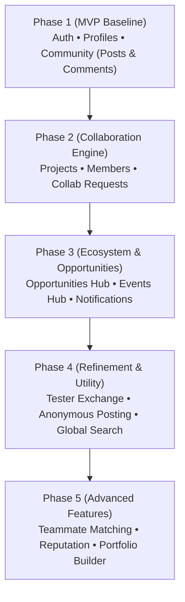

# Nex Community Platform — Frontend Implementation & Architecture Roadmap

> **Target Audience:** Frontend Builders & Engineers  
> **Based on:** `Nex-Community-Platform-Technical-Spec.pdf` & `NexAssetsReference.pdf`  
> **Design Philosophy:** "Anti-AI Slop" — Clean, functional, minimalist, high-craft developer & student ecosystem (inspired by Linear, Vercel, Supabase, and GitHub).

---

## 1. Design & Engineering Foundation (Official Nex Brand Guidelines)

Based on the 12-page Canva brand asset reference (`NexAssetsReference.pdf`), the exact branding tokens to prevent AI slop are:

### Official Brand Color Tokens
* **Dark Background (Base Canvas):** `#1b1a1f` (Obsidian Charcoal / Deep Black)
* **Dark Card / Surface:** `#232228` (Subtle elevated dark container)
* **Brand Primary Accent:** `#5cd6d7` (Electric Aqua / Vibrant Neon Cyan)
* **Light Mode Canvas:** `#ffffff` (Clean white, as seen on Canva Slide 4)
* **Light Mode Surface:** `#f4f4f5` (Light zinc/grey container)
* **Text Contrast:**
  * Dark mode: Pure White `#ffffff` (Headings) and Muted Slate `#94a3b8` (Body/Subtext)
  * Light mode: Deep Charcoal `#1b1a1f` (Headings) and Muted Charcoal `#64748b` (Body)

### Official Typography Pairing
* **Headlines / Display / Brand Titles:** 
  * Primary: **`Poppins` (Bold / SemiBold)** or **`Space Grotesk`** (reflecting the bold, high-impact Canva display type).
  * Brand Wordmark: Bold condensed display with slanted neon cyan 'x' (`nex`).
* **Body / Subheadings / UI Labels:**
  * **`Raleway`** (regular & medium) — Directly specified across Canva slides 2–10 for all descriptions and body copy.
* **Monospace (Code / Tech Badges):**
  * `Geist Mono` or `JetBrains Mono` for tech tags, status badges, and repository URLs.

### Official Brand Microcopy (Anti-Slop Content Guidelines)
Never use generic AI filler copy or "Lorem Ipsum". Use Nex's verified brand voice:
* **Motto / Tagline:** *"Learn. Build. Collaborate. Compete. Connect."*
* **Hero / Action Callout:** *"Ready to take your NEX step in tech?"* / *"Make your NEX move."*
* **Community Mission Statement:**  
  > *"NEX is a student-driven tech community built for learners, creators, innovators, and future tech professionals. Whether you're just getting started or already building your own projects, there's a place for you here."*
* **Platform Handle / Domain:** `/nexcreate` • `nex-network.vercel.app`

### Spacing & Component Standard
* **Component Library:** **`shadcn/ui` (Radix Primitives + Tailwind CSS)** configured with `#1b1a1f` as background and `#5cd6d7` as primary accent.
* **Tailwind Rule:** Strictly adhere to default Tailwind spacing (`gap-2`, `gap-4`, `gap-6`, `p-4`, `p-6`). No arbitrary manual paddings or disconnected colors.

---

## 2. Platform Page & Section Directory

Based on Section 4, 5, 8–18 of the Technical Specification, here is the complete map of **pages and screens** required:

### Summary Count
* **Core Screens:** **9 primary modules / ~16 distinct page views**
* **Overlays / Drawers:** **6 key modals/drawers** (Create Post, Create Project, Apply Collab, Register Event, Tester Signup, Search `Ctrl+K`)

---

### Route Tree & Page Breakdown

```
nex-platform/app/
│
├── (auth)/
│   ├── login/page.tsx               # Screen 1: Login
│   ├── register/page.tsx            # Screen 2: Registration (Student details)
│   ├── verify-email/page.tsx        # Screen 3: Email confirmation notice
│   └── onboarding/page.tsx          # Screen 4: Interest & skills selection
│
├── (main)/layout.tsx                # Global Shell (Sidebar + Header + Notifications + Search)
│   │
│   ├── dashboard/page.tsx           # Screen 5: Student Hub Dashboard
│   │
│   ├── community/
│   │   ├── page.tsx                 # Screen 6: Community Feed (Filters, Tabs)
│   │   └── [postId]/page.tsx        # Screen 7: Post Detail + Nested Comments
│   │
│   ├── projects/
│   │   ├── page.tsx                 # Screen 8: Projects Directory & Discovery
│   │   ├── new/page.tsx             # Screen 9: Create Project Form
│   │   └── [id]/page.tsx            # Screen 10: Project Overview, Members & Collab Requests
│   │
│   ├── opportunities/
│   │   ├── page.tsx                 # Screen 11: Opportunities Catalog (Hackathons, Internships)
│   │   └── saved/page.tsx           # Screen 12: Bookmarked/Saved Opportunities
│   │
│   ├── events/
│   │   ├── page.tsx                 # Screen 13: Event Directory (Calendar / Grid)
│   │   └── [id]/page.tsx            # Screen 14: Event Detail & Registration
│   │
│   ├── testers/
│   │   └── page.tsx                 # Screen 15: Beta Tester Requests Board
│   │
│   └── profile/
│       ├── [username]/page.tsx      # Screen 16: Public Student Profile & Portfolio
│       └── settings/page.tsx        # Screen 17: Profile & Account Settings
│
└── admin/
    └── moderation/page.tsx          # Screen 18: Moderator Queue (Reports, Takedowns)
```

---

## 3. Screen-by-Screen Specifications

### Module 1: Authentication & Onboarding (`app/(auth)`)
* **`login/page.tsx`**:
  * Clean centered card. Email + Password form + Google OAuth button. Link to register.
* **`register/page.tsx`**:
  * Two-column or structured card:
    * Standard auth: Email, Password.
    * Student metadata (Required by spec): First Name, Last Name, School (`school_id`), Course, Year Level.
* **`verify-email/page.tsx`**:
  * Email confirmation instructions screen with "Resend link" button.
* **`onboarding/page.tsx`**:
  * Interactive chip selector for initial Skills (`React`, `Python`, `Figma`, etc.) and Interests (`AI`, `Web3`, `IoT`, `Hackathons`).

---

### Module 2: Global Shell & Dashboard (`app/(main)`)
* **Layout Shell (`layout.tsx`)**:
  * **Sidebar:** Logo ("NEX"), Nav items (Dashboard, Community, Projects, Opportunities, Events, Testers), User avatar badge.
  * **Top Header:** Global Search trigger (`Ctrl+K`), Notification Bell with badge counter, Post quick-action button ("+ New").
* **`dashboard/page.tsx`**:
  * **Welcome banner:** Personalized greeting with student name & school badge.
  * **Quick Stats/Pills:** Active projects, applied collabs, upcoming events.
  * **Curated Feed:** Recent trending community discussions & hackathon countdowns.

---

### Module 3: Community System (`app/community`)
* **`community/page.tsx` (Main Feed)**:
  * **Category Filter Tabs:** `ALL`, `DISCUSSION`, `QUESTION`, `PROJECT`, `COLLABORATION`, `OPPORTUNITY`, `ANNOUNCEMENT`.
  * **Create Post Card / Trigger:** Minimal input at top ("Start a discussion or share a project...").
  * **Feed Card:** Author avatar (or Anonymous alias shield), timestamp, title, preview text, category tag, upvote/reaction counter, comment counter.
* **`community/[postId]/page.tsx` (Post Detail)**:
  * Full markdown content render.
  * Anonymous post handling: If `is_anonymous = true`, show "Anonymous Student" avatar to normal users (preserve moderator audit visibility).
  * **Comments Thread:** Form to reply + recursive comment list with timestamp and upvotes.

---

### Module 4: Projects & Collaborations (`app/projects`)
* **`projects/page.tsx` (Directory)**:
  * Search input + Status filters (`IDEA`, `PLANNING`, `PROTOTYPE`, `DEVELOPMENT`, `COMPLETED`).
  * Project cards displaying: Name, short description, category, tech stack tags, member avatars, repository & demo external links.
* **`projects/[id]/page.tsx` (Project View)**:
  * Header with repository and demo buttons.
  * "Looking for Collaborators" section listing open positions with required skills.
  * Project team list (owner, members, roles).
  * Action: "Request to Join" button (opens application message modal).

---

### Module 5: Opportunities & Hackathons (`app/opportunities`)
* **`opportunities/page.tsx`**:
  * Category Pills: `HACKATHON`, `IDEATHON`, `COMPETITION`, `INTERNSHIP`, `SCHOLARSHIP`, `FELLOWSHIP`, `WORKSHOP`.
  * Location filter (`Online` vs `On-site`).
  * Card elements: Organizer badge, deadline countdown pill, eligibility badge, "Save" bookmark button, "Apply" outbound link.

---

### Module 6: Events System (`app/events`)
* **`events/page.tsx`**:
  * Split view or cards: Upcoming events, workshops, hackathon kickoffs.
  * Event Card: Banner image, title, date & time range, location, capacity counter (e.g. `45/100 spots taken`).
* **`events/[id]/page.tsx`**:
  * Full agenda, speaker info, location map/link, "Register for Event" modal trigger.

---

### Module 7: Beta Tester Exchange (`app/testers`)
* **`testers/page.tsx`**:
  * Student builder requests for user testing (e.g. "Need 5 testers for student fintech prototype - 15 mins").
  * Fields shown: Project title, time commitment, slots needed, deadline, "Sign Up to Test" button.

---

### Module 8: Profile & Portfolio (`app/profile`)
* **`profile/[username]/page.tsx`**:
  * User header: Avatar, Name, Username, School, Course & Year Level, Social Links (GitHub, LinkedIn, Portfolio).
  * Tabs:
    * **Projects:** Projects created or joined.
    * **Contributions / Posts:** User's discussions and questions.
    * **Skills & Badges:** Verified skills chips.
* **`profile/settings/page.tsx`**:
  * Edit Bio, change school/course, upload profile picture (Supabase Storage).

---

### Module 9: Admin & Moderation (`app/admin`)
* **`admin/moderation/page.tsx`**:
  * Table of flagged reports (`Spam`, `Harassment`, `Scam`, `Inappropriate Content`).
  * Action buttons: Dismiss, Remove Post, Suspend User.

---

## 4. Phased Development Roadmap

Aligned with Section 23 of the Technical Specification:



### Phase 1: MVP Baseline (Weeks 1–2)
* **Goal:** A user can register as a student, login, set up their profile, post a topic in the community, and reply to others.
* **Frontend Scope:**
  1. Next.js 14+ scaffold with Tailwind and `shadcn/ui`.
  2. Setup global shell layout (`Sidebar`, `Header`).
  3. Auth pages (`login`, `register`, `onboarding`).
  4. Community feed (`app/community`) + Post detail + Comment section.
  5. Student profile view (`app/profile/[username]`).

### Phase 2: Collaboration & Projects (Weeks 3–4)
* **Goal:** Students can showcase projects and recruit teammates.
* **Frontend Scope:**
  1. Projects listing and status filtering.
  2. Project creation form (`repository_url`, `demo_url`, tags).
  3. "Collaboration Requests" section and "Apply" drawer.
  4. Project Member management view.

### Phase 3: Opportunities, Events & Alerts (Weeks 5–6)
* **Goal:** Students can discover hackathons, register for events, and get notified.
* **Frontend Scope:**
  1. Opportunities catalog with category pills and save/bookmark toggle.
  2. Events listing and RSVP modal.
  3. Real-time Notification dropdown / list.

### Phase 4: Beta Testing, Anonymous Mode & Polish (Weeks 7–8)
* **Goal:** High utility builder features & search.
* **Frontend Scope:**
  1. Tester Request board and signups.
  2. Anonymous toggle UI (with safety indicators).
  3. Global `Ctrl+K` Command palette search (Posts, Projects, Users).
  4. Moderation dashboard for admins.

---

## 5. Summary Cheat-Sheet for Frontend Developers

| Page/Module | Main Route | Priority | Key Components |
|---|---|---|---|
| **Login / Register** | `/login`, `/register` | Phase 1 | `AuthCard`, `StudentRegisterForm`, `GoogleOAuthBtn` |
| **Onboarding** | `/onboarding` | Phase 1 | `SkillSelectorChip`, `InterestTagGrid` |
| **Dashboard** | `/dashboard` | Phase 1 | `AppSidebar`, `Header`, `StatsCard`, `ActivityFeed` |
| **Community Feed** | `/community` | Phase 1 | `CategoryPills`, `PostCard`, `CreatePostDialog` |
| **Post Detail** | `/community/[id]` | Phase 1 | `PostContent`, `CommentTree`, `CommentInput` |
| **User Profile** | `/profile/[username]` | Phase 1 | `ProfileHeader`, `BadgeChip`, `UserProjectList` |
| **Projects Hub** | `/projects` | Phase 2 | `ProjectCard`, `StatusBadge`, `FilterBar` |
| **Project Details** | `/projects/[id]` | Phase 2 | `MemberAvatarGroup`, `CollabRequestCard`, `ApplyModal` |
| **Opportunities** | `/opportunities` | Phase 3 | `OpportunityCard`, `BookmarkBtn`, `DeadlineBadge` |
| **Events** | `/events` | Phase 3 | `EventCard`, `RegistrationModal`, `CalendarBadge` |
| **Tester Board** | `/testers` | Phase 4 | `TesterCard`, `SignupDialog` |
| **Moderation** | `/admin/moderation` | Phase 4 | `ReportTable`, `ActionConfirmDialog` |
