# Nex Community Platform — Database Schema & Architecture Guide

> **Target Database:** PostgreSQL 15+ (Tailored for Supabase PostgreSQL)  
> **Normalization Standard:** Third Normal Form (3NF) & Boyce-Codd Normal Form (BCNF)  
> **Technical Specification Reference:** `Nex-Community-Platform-Technical-Spec.pdf`  
> **Frontend Specification Reference:** `FRONTEND_ROADMAP_AND_SPECS.md` & `PlatformPages.md`

---

## 1. Executive Summary

There was previously **no database schema** configured in this repository (only UI scaffolds, boilerplate configs, and the PDF technical specification).

To fulfill the requirements outlined in the **Nex Community Platform Technical Specification**, we have designed, normalized, and implemented a production-ready PostgreSQL database schema.

### Core Architectural Highlights
* **Strict Normalization (3NF / BCNF):** Redundant multi-valued fields (skills, interests, university details) are factored into dedicated relation entities (`schools`, `skills`, `interests`, `post_categories`) connected via normalized M:N junction tables (`profile_skills`, `profile_interests`, `project_skills`, `collab_request_skills`).
* **Supabase Auth Integration:** Synchronized with `auth.users` via database triggers (`handle_new_user`), generating user profiles with default student roles upon account registration.
* **Anonymous Posting Privacy Layer:** Supports anonymous posts and comments (`is_anonymous = true`) while retaining `author_id` in the database for moderation audit trails. A dedicated abstraction view (`community_posts_view`) masks author identity for normal users while displaying author details to moderators.
* **Row-Level Security (RLS):** Every single table is secured with explicit RLS policies mapped to user roles (`STUDENT`, `MODERATOR`, `ADMINISTRATOR`).
* **Built-in Full-Text Search (FTS):** Automated `tsvector` generated columns with PostgreSQL GIN indexes on Posts, Projects, Opportunities, and Events, complemented by a unified `search_platform()` stored function.
* **Audit Triggers:** Automated `updated_at` timestamps on all mutable entities.

---

## 2. Entity-Relationship Diagram (ERD)

```mermaid
erDiagram
    AUTH_USERS ||--o| PROFILES : "has profile (1:1)"
    SCHOOLS ||--o{ PROFILES : "enrolls (1:N)"
    PROFILES ||--o{ PROFILE_SKILLS : "has"
    SKILLS ||--o{ PROFILE_SKILLS : "belongs to"
    PROFILES ||--o{ PROFILE_INTERESTS : "interested in"
    INTERESTS ||--o{ PROFILE_INTERESTS : "tagged in"

    POST_CATEGORIES ||--o{ POSTS : "categorizes"
    AUTH_USERS ||--o{ POSTS : "authors (1:N)"
    POSTS ||--o{ COMMENTS : "contains (1:N)"
    COMMENTS ||--o{ COMMENTS : "nested replies"
    AUTH_USERS ||--o{ COMMENTS : "writes (1:N)"
    POSTS ||--o{ POST_REACTIONS : "receives"
    AUTH_USERS ||--o{ POST_REACTIONS : "reacts"
    COMMENTS ||--o{ COMMENT_REACTIONS : "receives"
    AUTH_USERS ||--o{ COMMENT_REACTIONS : "reacts"

    AUTH_USERS ||--o{ PROJECTS : "owns (1:N)"
    PROJECTS ||--o{ PROJECT_MEMBERS : "roster (1:N)"
    AUTH_USERS ||--o{ PROJECT_MEMBERS : "member of"
    PROJECTS ||--o{ PROJECT_REQUESTS : "join requests"
    AUTH_USERS ||--o{ PROJECT_REQUESTS : "applies"
    PROJECTS ||--o{ PROJECT_SKILLS : "uses stack"
    SKILLS ||--o{ PROJECT_SKILLS : "applied in"

    PROJECTS ||--o{ COLLABORATION_REQUESTS : "opens"
    COLLABORATION_REQUESTS ||--o{ COLLABORATION_APPLICATIONS : "receives"
    AUTH_USERS ||--o{ COLLABORATION_APPLICATIONS : "applies"

    PROJECTS ||--o{ TESTER_REQUESTS : "seeks testers"
    TESTER_REQUESTS ||--o{ TESTER_SIGNUPS : "signups"
    AUTH_USERS ||--o{ TESTER_SIGNUPS : "tests"

    OPPORTUNITIES ||--o{ SAVED_OPPORTUNITIES : "bookmarked"
    AUTH_USERS ||--o{ SAVED_OPPORTUNITIES : "bookmarks"

    EVENTS ||--o{ EVENT_REGISTRATIONS : "has RSVPs"
    AUTH_USERS ||--o{ EVENT_REGISTRATIONS : "attends"

    AUTH_USERS ||--o{ NOTIFICATIONS : "receives"
    AUTH_USERS ||--o{ REPORTS : "files / reviews"
```



---

## 3. Database Normalization Analysis

### First Normal Form (1NF) Compliance
- Every table has a distinct primary key (`id UUID PRIMARY KEY DEFAULT gen_random_uuid()`).
- All columns hold strictly atomic values.
- Multi-valued attributes (e.g., student skills, tech stack, interests) are eliminated from parent rows and represented as individual rows in junction tables (`profile_skills`, `project_skills`, `profile_interests`).

### Second Normal Form (2NF) Compliance
- All non-key attributes are fully dependent on the primary key.
- In junction tables with composite primary keys (`profile_skills(profile_id, skill_id)`, `saved_opportunities(user_id, opportunity_id)`), any additional metadata (e.g., `created_at`) depends on the complete composite key.

### Third Normal Form (3NF) & BCNF Compliance
- Zero transitive dependencies:
  - School attributes (`name`, `short_name`, `domain`, `logo_url`) are isolated in `schools`. Profiles only store `school_id`, preventing update anomalies when school details change.
  - Categories are isolated in `post_categories`.
  - Roles are validated through the PostgreSQL ENUM `user_role` and RBAC helper functions (`is_moderator()`, `is_admin()`).
  - Hierarchical parent-child comment threading uses a recursive foreign key `parent_id REFERENCES comments(id)` rather than storing nested arrays or path strings.

---

## 4. Complete Table Directory & Data Dictionary

### Taxonomy & Lookup Tables

#### `schools`
Stores colleges and universities.
| Column | Type | Constraints | Description |
|---|---|---|---|
| `id` | `UUID` | `PK, DEFAULT gen_random_uuid()` | Unique school identifier |
| `name` | `TEXT` | `NOT NULL, UNIQUE` | Full official name (e.g. "University of the Philippines Diliman") |
| `short_name` | `VARCHAR(50)` | `NULLABLE` | Common abbreviation (e.g. "UPD", "DLSU", "UST") |
| `slug` | `VARCHAR(100)` | `NOT NULL, UNIQUE` | URL-safe slug |
| `domain` | `VARCHAR(255)` | `NULLABLE` | University email domain (e.g. "upd.edu.ph") |
| `logo_url` | `TEXT` | `NULLABLE` | School crest/logo CDN URL |
| `created_at` | `TIMESTAMPTZ` | `NOT NULL, DEFAULT now()` | Record creation timestamp |

#### `skills`
Master catalog of developer and student technical skills.
| Column | Type | Constraints | Description |
|---|---|---|---|
| `id` | `UUID` | `PK, DEFAULT gen_random_uuid()` | Unique skill identifier |
| `name` | `VARCHAR(100)` | `NOT NULL, UNIQUE` | Skill name (e.g. "React", "PyTorch", "PostgreSQL") |
| `slug` | `VARCHAR(100)` | `NOT NULL, UNIQUE` | URL-safe slug |
| `category` | `VARCHAR(100)` | `NULLABLE` | Grouping (Frontend, Backend, AI/ML, Design, etc.) |
| `created_at` | `TIMESTAMPTZ` | `NOT NULL, DEFAULT now()` | Record creation timestamp |

#### `interests`
Master catalog of tech topics for student onboarding.
| Column | Type | Constraints | Description |
|---|---|---|---|
| `id` | `UUID` | `PK, DEFAULT gen_random_uuid()` | Unique interest identifier |
| `name` | `VARCHAR(100)` | `NOT NULL, UNIQUE` | Interest name (e.g. "AI & Machine Learning", "Hackathons") |
| `slug` | `VARCHAR(100)` | `NOT NULL, UNIQUE` | URL-safe slug |
| `created_at` | `TIMESTAMPTZ` | `NOT NULL, DEFAULT now()` | Record creation timestamp |

#### `post_categories`
Discussion channels and topics.
| Column | Type | Constraints | Description |
|---|---|---|---|
| `id` | `UUID` | `PK, DEFAULT gen_random_uuid()` | Unique category identifier |
| `name` | `VARCHAR(100)` | `NOT NULL, UNIQUE` | Display name |
| `slug` | `VARCHAR(100)` | `NOT NULL, UNIQUE` | URL slug |
| `description` | `TEXT` | `NULLABLE` | Channel purpose |
| `post_type` | `post_type` | `NOT NULL, DEFAULT 'DISCUSSION'` | Associated post type |
| `created_at` | `TIMESTAMPTZ` | `NOT NULL, DEFAULT now()` | Record creation timestamp |

---

### User & Profile Management

#### `profiles`
Extended student profile information linked to Supabase Auth.
| Column | Type | Constraints | Description |
|---|---|---|---|
| `id` | `UUID` | `PK, DEFAULT gen_random_uuid()` | Unique profile ID |
| `user_id` | `UUID` | `NOT NULL, UNIQUE, FK -> auth.users(id) ON DELETE CASCADE` | Associated Supabase Auth account |
| `first_name` | `VARCHAR(100)` | `NOT NULL` | Student first name |
| `last_name` | `VARCHAR(100)` | `NOT NULL` | Student last name |
| `username` | `VARCHAR(50)` | `NOT NULL, UNIQUE, CHECK regex` | Public username handle (`/profile/[username]`) |
| `school_id` | `UUID` | `FK -> schools(id) ON DELETE SET NULL` | Student's university |
| `course` | `VARCHAR(150)` | `NULLABLE` | Degree program (e.g. "BS Computer Science") |
| `year_level` | `SMALLINT` | `CHECK (1-6)` | Current college year |
| `bio` | `TEXT` | `NULLABLE` | Student bio |
| `avatar_url` | `TEXT` | `NULLABLE` | Profile avatar image |
| `github_url` | `TEXT` | `NULLABLE` | GitHub portfolio link |
| `linkedin_url`| `TEXT` | `NULLABLE` | LinkedIn link |
| `portfolio_url`| `TEXT` | `NULLABLE` | Personal website link |
| `role` | `user_role` | `NOT NULL, DEFAULT 'STUDENT'` | Access level (`STUDENT`, `MODERATOR`, `ADMINISTRATOR`) |
| `onboarding_completed` | `BOOLEAN` | `NOT NULL, DEFAULT FALSE` | Onboarding progress flag |
| `created_at` | `TIMESTAMPTZ` | `NOT NULL, DEFAULT now()` | Creation timestamp |
| `updated_at` | `TIMESTAMPTZ` | `NOT NULL, DEFAULT now()` | Auto-updated via trigger |

#### `profile_skills` (Junction)
Many-to-Many relationship between students and skills.
* `profile_id UUID REFERENCES profiles(id) ON DELETE CASCADE`
* `skill_id UUID REFERENCES skills(id) ON DELETE CASCADE`
* `PRIMARY KEY (profile_id, skill_id)`

#### `profile_interests` (Junction)
Many-to-Many relationship between students and interests.
* `profile_id UUID REFERENCES profiles(id) ON DELETE CASCADE`
* `interest_id UUID REFERENCES interests(id) ON DELETE CASCADE`
* `PRIMARY KEY (profile_id, interest_id)`

---

### Community & Discussion Feed

#### `posts`
Community forum posts across discussions, questions, and project showcases.
| Column | Type | Constraints | Description |
|---|---|---|---|
| `id` | `UUID` | `PK, DEFAULT gen_random_uuid()` | Post identifier |
| `author_id` | `UUID` | `NOT NULL, FK -> auth.users(id) ON DELETE CASCADE` | Creator user ID |
| `category_id` | `UUID` | `FK -> post_categories(id) ON DELETE SET NULL` | Topic category |
| `title` | `VARCHAR(255)` | `NOT NULL` | Post headline |
| `content` | `TEXT` | `NOT NULL` | Markdown body content |
| `post_type` | `post_type` | `NOT NULL, DEFAULT 'DISCUSSION'` | Category type enum |
| `is_anonymous` | `BOOLEAN` | `NOT NULL, DEFAULT FALSE` | Flag to mask author from normal users |
| `is_pinned` | `BOOLEAN` | `NOT NULL, DEFAULT FALSE` | Moderator pin |
| `is_locked` | `BOOLEAN` | `NOT NULL, DEFAULT FALSE` | Moderator lock |
| `view_count` | `INTEGER` | `NOT NULL, DEFAULT 0, CHECK (>=0)`| View analytics |
| `search_vector`| `tsvector`| `STORED GENERATED` | English full-text search vector |
| `created_at` | `TIMESTAMPTZ` | `NOT NULL, DEFAULT now()` | Creation timestamp |
| `updated_at` | `TIMESTAMPTZ` | `NOT NULL, DEFAULT now()` | Trigger updated |

#### `comments`
Recursive threaded comment section.
| Column | Type | Constraints | Description |
|---|---|---|---|
| `id` | `UUID` | `PK, DEFAULT gen_random_uuid()` | Comment identifier |
| `post_id` | `UUID` | `NOT NULL, FK -> posts(id) ON DELETE CASCADE` | Associated post |
| `author_id` | `UUID` | `NOT NULL, FK -> auth.users(id) ON DELETE CASCADE` | Commenter user ID |
| `parent_id` | `UUID` | `FK -> comments(id) ON DELETE CASCADE, CHECK (parent_id <> id)` | Threaded reply parent |
| `content` | `TEXT` | `NOT NULL` | Comment body |
| `is_anonymous` | `BOOLEAN` | `NOT NULL, DEFAULT FALSE` | Anonymous reply toggle |
| `created_at` | `TIMESTAMPTZ` | `NOT NULL, DEFAULT now()` | Creation timestamp |
| `updated_at` | `TIMESTAMPTZ` | `NOT NULL, DEFAULT now()` | Trigger updated |

#### `post_reactions` & `comment_reactions`
Normalized upvotes/reactions with relational constraints:
* `(post_id, user_id, reaction_type)` is unique per user to prevent duplicate upvotes.
* `(comment_id, user_id, reaction_type)` is unique per user.

---

### Projects, Teammates & Testers

#### `projects`
Showcase of student side projects, hackathon prototypes, and open source repositories.
| Column | Type | Constraints | Description |
|---|---|---|---|
| `id` | `UUID` | `PK, DEFAULT gen_random_uuid()` | Project ID |
| `owner_id` | `UUID` | `NOT NULL, FK -> auth.users(id) ON DELETE CASCADE` | Project creator |
| `name` | `VARCHAR(150)` | `NOT NULL` | Project title |
| `slug` | `VARCHAR(160)` | `NOT NULL, UNIQUE` | Clean URL slug |
| `tagline` | `VARCHAR(255)` | `NULLABLE` | One-sentence elevator pitch |
| `description` | `TEXT` | `NOT NULL` | Detailed project description |
| `category` | `VARCHAR(100)` | `NOT NULL` | E.g. Web App, Mobile, AI/ML |
| `status` | `project_status`| `NOT NULL, DEFAULT 'IDEA'` | `IDEA`, `PLANNING`, `PROTOTYPE`, `DEVELOPMENT`, `COMPLETED`, `ARCHIVED` |
| `repository_url`| `TEXT` | `NULLABLE` | GitHub/GitLab link |
| `demo_url` | `TEXT` | `NULLABLE` | Live preview URL |
| `cover_image_url`| `TEXT` | `NULLABLE` | Banner / preview image |
| `search_vector`| `tsvector`| `STORED GENERATED` | FTS search vector |

#### `project_members`
Active roster of contributors on a project (`project_id`, `user_id`, `role`, `joined_at`).

#### `collaboration_requests` & `collaboration_applications`
Teammate recruitment board:
* Project owners post open roles with required skills (`collaboration_request_skills`).
* Interested students submit applications with personal messages.

#### `tester_requests` & `tester_signups`
Beta tester exchange:
* Students list testing needs (e.g., "Need 5 testers for fintech prototype - 15 mins").
* Testers sign up and submit structured feedback.

---

### Opportunities & Events

#### `opportunities` & `saved_opportunities`
Hackathons, internships, scholarships, and fellowships.
* Supports category filtering (`HACKATHON`, `INTERNSHIP`, `SCHOLARSHIP`, etc.).
* Students can bookmark items via `saved_opportunities(user_id, opportunity_id)`.

#### `events` & `event_registrations`
Workshops, tech meetups, and hackathon kickoff sessions.
* Date validation: `CHECK (end_date >= start_date)`.
* Capacity enforcement: `capacity INTEGER CHECK (capacity IS NULL OR capacity > 0)`.
* RSVP tracking: `event_registrations(event_id, user_id)`.

---

### Notifications, Moderation & Safety

#### `notifications`
Real-time alerts for post replies, collaboration invitations, project acceptances, event reminders, and moderator warnings.

#### `reports`
Content moderation tracking for spam, harassment, and abuse. Supports full audit flow (`PENDING` -> `REVIEWED` -> `DISMISSED` / `ACTION_TAKEN`).

---

## 5. Security & Row-Level Security (RLS) Matrix

| Entity | Public / Anonymous | Authenticated Student | Content Owner | Moderator / Admin |
|---|---|---|---|---|
| `schools`, `skills`, `interests` | Read | Read | Read | Manage |
| `profiles` | Read | Read | Update Own Profile | Manage All |
| `posts` | Read | Create Post | Update / Delete Own | Pin, Lock, Delete |
| `comments` | Read | Create Comment | Update / Delete Own | Delete Any |
| `projects` | Read | Create Project | Update / Delete Own | Manage |
| `collaboration_requests` | Read | Read | Create / Close | Manage |
| `collaboration_applications` | None | Create Application | View & Accept/Reject | View All |
| `tester_requests` | Read | Read | Create / Close | Manage |
| `tester_signups` | None | Sign Up / Give Feedback| View Testers | View All |
| `saved_opportunities` | None | Manage Own Bookmarks | Manage Own | None |
| `event_registrations` | None | Register / Cancel Own | View Attendees | Manage All |
| `notifications` | None | View / Dismiss Own | View Own | None |
| `reports` | None | Submit Report | View Own Submitted | Review & Resolve |

---

## 6. How to Deploy the Schema

### Option A: Using Supabase Dashboard (Web SQL Editor)
1. Open your project on [database.new](https://database.new) or the [Supabase Dashboard](https://supabase.com/dashboard).
2. Navigate to **SQL Editor**.
3. Copy the entire contents of [`supabase/schema.sql`](file:///c:/Users/Windows%2010/Documents/Coding%20Projects/New%20folder/Nex-Platform/supabase/schema.sql) and paste it into the editor.
4. Click **Run**.
5. Copy the contents of [`supabase/seed.sql`](file:///c:/Users/Windows%2010/Documents/Coding%20Projects/New%20folder/Nex-Platform/supabase/seed.sql) and click **Run** to load universities, skills, and categories.

### Option B: Using Supabase CLI (Local or Remote Migration)
```bash
# Link to your Supabase project
npx supabase link --project-ref your-project-id

# Push migrations
npx supabase db push

# Seed data
npx supabase db reset # or execute seed.sql
```

### Option C: Using Standard PostgreSQL (`psql`)
```bash
psql -h localhost -U postgres -d nex_db -f supabase/schema.sql
psql -h localhost -U postgres -d nex_db -f supabase/seed.sql
```

---

## 7. TypeScript Client Usage

Full TypeScript interfaces matching the database are available in [`types/database.types.ts`](file:///c:/Users/Windows%2010/Documents/Coding%20Projects/New%20folder/Nex-Platform/types/database.types.ts).

### Example: Typed Supabase Query in Next.js Server Component
```tsx
import { createClient } from "@/lib/supabase/server";

export default async function CommunityFeed() {
  const supabase = await createClient();

  // Queries are fully type-checked with autocomplete!
  const { data: posts, error } = await supabase
    .from("posts")
    .select(`
      id,
      title,
      content,
      post_type,
      is_anonymous,
      created_at,
      author:profiles!posts_author_id_fkey(username, avatar_url, school:schools(short_name)),
      comments:comments(count)
    `)
    .order("created_at", { ascending: false })
    .limit(20);

  if (error) {
    return <div>Error loading posts: {error.message}</div>;
  }

  return (
    <ul>
      {posts.map((post) => (
        <li key={post.id}>
          <h3>{post.title}</h3>
          <p>{post.is_anonymous ? "Anonymous Student" : post.author?.username}</p>
        </li>
      ))}
    </ul>
  );
}
```
